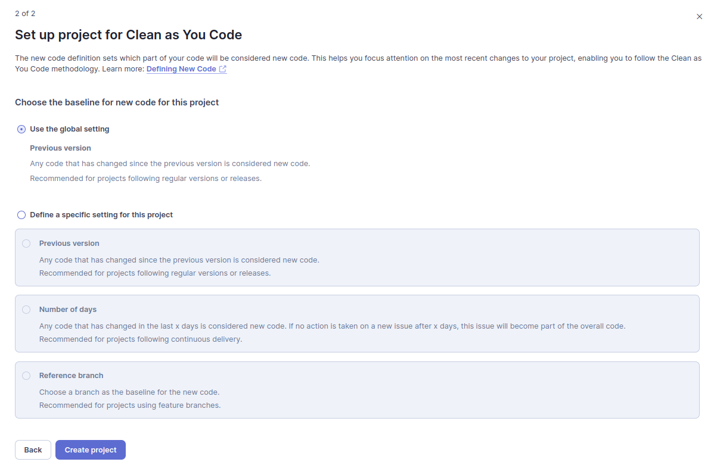

# New World

<details>
<summary> Problem to solve... </summary>


## 🎯 Objectives
This project aims to develop a robust and secure backend in Golang using the Fiber framework. It will serve as the technological backbone for a survival store that strategically manages and sells surplus supplies to other refugee communities.

## 📝 Evaluation Aspects
- **Code Quality and Architecture**: Implement a clean, well-organized Model-Service-Repository pattern ensuring modularity and maintainability.
- **Functionality**: Robust functionality across all server endpoints for accurate, real-time supply management.
- **Security**: Secure API access with JWT authentication to ensure data integrity and protect against unauthorized access. We are also using TLS as a security layer.
- **Scalability**: The application should be scalable, and designed to handle increasing loads and concurrent users efficiently.
- **Documentation**: Detailed documentation should include setup instructions, API usage examples, and deployment guidelines.

## 📽 🎞 New World
*As Joel and his team of survivors continue their mission to stabilize their world, the real-time monitoring application has become more than just a tool; it's a symbol of revival and human resilience. As they move beyond their underground confines, the survivors use their technological prowess to reach out to other isolated groups, hoping to expand their network and enhance their collective strength.*

*With the application's real-time data, they identify a series of potentially habitable zones unclaimed by the fungal scourge. Plans are swiftly put into motion to explore these areas. Each mission is carefully monitored from the control room, where the team can react instantly to any sign of danger or opportunity, adjusting their strategies based on live environmental data.*

<p align="center">
  
</p>

*With surplus supplies now more abundant thanks to efficient resource management, the survivors initiate trade with nearby communities. They use the application to manage trade logs, monitor resource levels, and schedule deliveries, turning the refuge into a bustling trade hub. This economic activity brings a semblance of normalcy and hope, strengthening community bonds and fostering economic resilience.*

## 🔑 Application Description

<p align="center">
  
</p>

Our backend application will interface with the existing HPCPP project to access and trade the current **20%** of the supply levels. Key components include:

- **Technology Stack**:
  - **Fiber**: Utilized for creating a high-performance HTTP server.
  - **Traefik**: Used as a reverse proxy and load balancer to efficiently manage and route requests.
  - **JWT**: Ensures secure endpoint access, allowing only authenticated users to view the market.
  - **Postgres**: Utilized for robust data storage and management.

- **Endpoints**:

<details>
 <summary><code>POST</code> <code><b>/auth/register</b></code> <code>(Register a new user)</code></summary>

##### Parameters

> | name      |  type     | data type               | example                                                           |
> |-----------|-----------|-------------------------|-----------------------------------------------------------------------|
> | data      |  required | `application/json`   | `{ "username": "john_doe", "email": "john@example.com", "password": "securepassword123" }`  |


##### Responses

> | http code     | content-type                      | response                                                            |
> |---------------|-----------------------------------|---------------------------------------------------------------------|
> | `500`         | `application/json`                | `{"code":"500","message":"Bad server"}`                            |
> | `201`         | `application/json`                | `{"code":"201","message":"User added"} `                           |
> | `400`         | `application/json`                | `{"code":"400","message":"Bad request"}`                           |

##### Example httpie

> ```javascript
>  echo -n '{ "username": "john_doe", "email": "john@example.com", "password": "securepassword123" }' | http POST localhost:3000/auth/register
> ```
</details>

<details>
 <summary><code>POST</code> <code><b>/auth/login</b></code> <code>(Authenticate a user)</code></summary>

##### Parameters

> | name      |  type     | data type               | example                                                           |
> |-----------|-----------|-------------------------|-----------------------------------------------------------------------|
> | data      |  required | `application/json`   | `{ "email": "john@example.com", "password": "securepassword123" }`  |


##### Responses

> | http code     | content-type                      | response                                                            |
> |---------------|-----------------------------------|---------------------------------------------------------------------|
> | `500`         | `application/json`                | `{"code":"500","message":"Bad server"}`                            |
> | `201`         | `application/json`                | `{"code":"200","auth":"JWT"} `                                     |
> | `400`         | `application/json`                | `{"code":"400","message":"Bad request"}`                           |

##### Example httpie

> ```javascript
>  echo -n '{ "email": "john@example.com", "password": "securepassword123" }' | http POST localhost:3000/auth/register
> ```
</details>


<details>
 <summary><code>GET</code> <code><b>/auth/offers</b></code> <code>(Retrieve a list of available offers)</code></summary>

##### Parameters

> | name      |  type     | data type               | example                                                           |
> |-----------|-----------|-------------------------|-----------------------------------------------------------------------|
> | data      |  required | `application/json`   | `securityDefinitions: jwt: type: apiKey name: Authorization in: header`  |


##### Responses

> | http code     | content-type                      | response                                                            |
> |---------------|-----------------------------------|---------------------------------------------------------------------|
> | `500`         | `application/json`                | `{"code":"500","message":"Bad server"}`                            |
> | `200`         | `application/json`                | `{"code":"200",{"message":[{"id":"1","name":"meat","quantity":100,"price":10,"category":"food"},{"id":"2","name":"vegetables","quantity":200,"price":5,"category":"food"},{"id":"3","name":"fruits","quantity":150,"price":8,"category":"food"},{"id":"4","name":"water","quantity":1000,"price":2,"category":"drink"},{"id":"5","name":"antibiotics","quantity":50,"price":15,"category":"medicine"},{"id":"6","name":"analgesics","quantity":100,"price":8,"category":"medicine"},{"id":"7","name":"bandages","quantity":100,"price":5,"category":"medicine"},{"id":"8","name":"pistol ammo","quantity":200,"price":1,"category":"ammo"},{"id":"9","name":"rifle ammo","quantity":300,"price":1.5,"category":"ammo"},{"id":"10","name":"shotgun ammo","quantity":100,"price":2,"category":"ammo"}]}} `                                     |
> | `401`         | `application/json`                | `{"code":"401","message":"Unauthorized"}`                           |

##### Example httpie

> ```javascript
>  http --auth-type=jwt --auth="<token>" GET localhost:3000/auth/offers
> ```
</details>

<details>
 <summary><code>POST</code> <code><b>/auth/checkout</b></code> <code>(Buy a list of orders)</code></summary>

##### Parameters

> | name      |  type     | data type               | example                                                           |
> |-----------|-----------|-------------------------|-----------------------------------------------------------------------|
> | data      |  required | `application/json`   | `{"order":{ "id": 1, items: [{"quantity":10,"product_id":1},{"quantity":5, "product_id":4},{"quantity":3,"product_id":2}]}`  |
> | data      |  required | `application/json`   | `securityDefinitions: jwt: type: apiKey name: Authorization in: header`  |


##### Responses

> | http code     | content-type                      | response                                                            |
> |---------------|-----------------------------------|---------------------------------------------------------------------|
> | `500`         | `application/json`                | `{"code":"500","message":"Bad server"}`                             |
> | `200`         | `application/json`                | `{"code":"200",{"message":{"total":"1000","status":"pending"}`|
> | `401`         | `application/json`                | `{"code":"401","message":"Unauthorized"}`                           |

##### Example httpie

> ```javascript
>  echo -n '{"order":{ "id": 1, items: [{"quantity":10,"product_id":1},{"quantity":5, "product_id":4},{"quantity":3,"product_id":2}]}' | http --auth-type=jwt --auth="<token>" POST localhost:3000/auth/checkout
> ```
</details>

<details>
 <summary><code>GET</code> <code><b>/auth/orders/:id</b></code> <code>(Get the status of a specific order)</code></summary>

##### Parameters

> | name      |  type     | data type               | example                                                           |
> |-----------|-----------|-------------------------|-----------------------------------------------------------------------|
> | data      |  required | `application/json`   | `securityDefinitions: jwt: type: apiKey name: Authorization in: header`  |


##### Responses

> | http code     | content-type                      | response                                                            |
> |---------------|-----------------------------------|---------------------------------------------------------------------|
> | `500`         | `application/json`                | `{"code":"500","message":"Bad server"}`                             |
> | `200`         | `application/json`                | `{"code":"200",{"message":{"status":{ "preparing/processing/shipped/delivered"}`|
> | `401`         | `application/json`                | `{"code":"401","message":"Unauthorized"}`                           |

##### Example httpie

> ```javascript
>  http --auth-type=jwt --auth="<token>" GET localhost:3000/auth/orders/1
> ```
</details>

<details>
 <summary><code>GET</code> <code><b>/admin/dashboard</b></code> <code>(Get status of all market)</code></summary>

##### Parameters

> | name      |  type     | data type               | example                                                           |
> |-----------|-----------|-------------------------|-----------------------------------------------------------------------|
> | data      |  required | `application/json`   | `securityDefinitions: jwt: type: apiKey name: Authorization in: header role: Admin`  |


##### Responses

> | http code     | content-type                      | response                                                            |
> |---------------|-----------------------------------|---------------------------------------------------------------------|
> | `500`         | `application/json`                | `{"code":"500","message":"Bad server"}`                             |
> | `200`         | `application/json`                | `{"code":"200",{"message":{ "offers": [ {"id": "1", "name": "meat", "quantity": 100, "price": 10, "category": "food"}, {"id": "2", "name": "vegetables", "quantity": 200, "price": 5, "category": "food"}, {"id": "3", "name": "fruits", "quantity": 150, "price": 8, "category": "food"}, {"id": "4", "name": "water", "quantity": 1000, "price": 2, "category": "drink"}, {"id": "5", "name": "antibiotics", "quantity": 50, "price": 15, "category": "medicine"}, {"id": "6", "name": "analgesics", "quantity": 100, "price": 8, "category": "medicine"}, {"id": "7", "name": "bandages", "quantity": 100, "price": 5, "category": "medicine"}, {"id": "8", "name": "pistol ammo", "quantity": 200, "price": 1, "category": "ammo"}, {"id": "9", "name": "rifle ammo", "quantity": 300, "price": 1.5, "category": "ammo"}, {"id": "10", "name": "shotgun ammo", "quantity": 100, "price": 2, "category": "ammo"} ], "orders": [ {"id": "1", "status": "pending", "total": 1000}, {"id": "2", "status": "pending", "total": 1000}, {"id": "3", "status": "processing", "total": 1000}, {"id": "4", "status": "shipped", "total": 1000}, {"id": "5", "status": "delivered", "total": 1000} ], "balance": 5000 }`|
> | `401`         | `application/json`                | `{"code":"401","message":"Unauthorized"}`                           |

##### Example httpie

> ```javascript
>  http --auth-type=jwt --auth="<token>" GET localhost:3000/admin/dashboard
> ```
</details>

<details>
 <summary><code>PATCH</code> <code><b>/admin/orders/:id</b></code> <code>(Update the status of a specific order)</code></summary>

##### Parameters

> | name      |  type     | data type               | example                                                           |
> |-----------|-----------|-------------------------|-----------------------------------------------------------------------|
> | data      |  required | `application/json`   | `{"status":{ "preparing/processing/shipped/delivered" }`  |
> | data      |  required | `application/json`   | `securityDefinitions: jwt: type: apiKey name: Authorization in: header role: Admin`  |


##### Responses

> | http code     | content-type                      | response                                                            |
> |---------------|-----------------------------------|---------------------------------------------------------------------|
> | `500`         | `application/json`                | `{"code":"500","message":"Bad server"}`                             |
> | `200`         | `application/json`                | `{"code":"200",{"message":{"status":{ "preparing/processing/shipped/delivered"}`|
> | `401`         | `application/json`                | `{"code":"401","message":"Unauthorized"}`                           |

##### Example httpie

> ```javascript
>  echo -n '{"status":{ "preparing/processing/shipped/delivered"}' | http --auth-type=jwt --auth="<token>" PATCH localhost:3000/auth/orders/1
> ```
</details>

## 📌 Tasks to Implement
- **Initialize Fiber Application**: Set up the project structure and basic server functionalities using the Fiber framework.
- **Implement the Model-Service-Repository Pattern**: Define models for supply data, services for business logic processing, and repositories for database interactions.
- **Secure API with JWT**: Configure JSON Web Tokens for authentication and authorization processes.
- **Traefik Integration**: Set up and configure Traefik as the entry point for the application to handle request routing.

### 〽️ Bonus

- **Dockerization**: Containerize both the Go backend and the React frontend to simplify deployment processes. Use `docker-compose` for easy multi-container orchestration.
- **Frontend Integration**: Ensure that the provided React project interfaces seamlessly with the backend, implementing features for authentication and displaying the supplies data.
- **REDIS Integration**: Ensure seamless integration of REDIS for optimized caching and enhanced data retrieval efficiency. 
- **Add more endpoints**: Improve the APP adding more endpoints.

<details>
 <summary><code>GET</code> <code><b>/admin/users</b></code> <code>(Get all buyers, only for admins)</code></summary>

 ##### Parameters

> | name      |  type     | data type               | example                                                           |
> |-----------|-----------|-------------------------|-----------------------------------------------------------------------|
> | data      |  required | `application/json`   | `securityDefinitions: jwt: type: apiKey name: Authorization in: header role: Admin`  |


##### Responses

> | http code     | content-type                      | response                                                            |
> |---------------|-----------------------------------|---------------------------------------------------------------------|
> | `500`         | `application/json`                | `{"code":"500","message":"Bad server"}`                             |
> | `200`         | `application/json`                | `{"code":"200",{"message":[{ "username": "john_doe", "email": "john@example.com"},...] } `|
> | `401`         | `application/json`                | `{"code":"401","message":"Unauthorized"}`                           |

</details>

<details>
 <summary><code>DELETE</code> <code><b>/admin/users/</b></code> <code>(Remove an customer)</code></summary>

  ##### Parameters

> | name      |  type     | data type               | example                                                           |
> |-----------|-----------|-------------------------|-----------------------------------------------------------------------|
> | data      |  required | `application/json`   | `{"user": [ 1, 5 ] }`  |
> | data      |  required | `application/json`   | `securityDefinitions: jwt: type: apiKey name: Authorization in: header role: Admin`  |


##### Responses

> | http code     | content-type                      | response                                                            |
> |---------------|-----------------------------------|---------------------------------------------------------------------|
> | `500`         | `application/json`                | `{"code":"500","message":"Bad server"}`                             |
> | `200`         | `application/json`                | `{"code":"200",{"message":"success" } `|
> | `401`         | `application/json`                | `{"code":"401","message":"Unauthorized"}`                           |
</details>

</details>


<details>
<summary> Solution description </summary>

# Operating Systems Lab 3 Solution Description
## Architecture 


## Project strucure
I followed [this](https://www.youtube.com/watch?v=EqniGcAijDI&t=453s&ab_channel=AnthonyGG) YT tutorial wich explains how to properly orginize an API project in Go and I made changes for my specific needs. 

## General Details: 
* I've integrated the frontend project with the API but only for the Register and Login features.
* Instead of making requests to the API's endpoints  the users will make requests to the configured traefik routes:
    * ```api.localhost/auth-admin/```
    * ```vm-api.localhost/supplies?id=latest``` or ```vm-api.localhost/alerts```
* All endpoints have been implemented and documented with Swagger.
* Due to lack of time, i've only created tests for the endpoints that I considered most important:
    *  ```/auth/offers```
    *  ```/auth/login```
    *  ```/auth/register```
    *  ```/admin/users```
    *  ```/admin/dashboard```
* Given that the endpoints interacted with the postgres db, I used mocks to achive the creation of the tests.
* Everything is dockerized, we have different docker containers living insede the docker network ```"market_network"```:
    * Frontend
    * Traefik
    * Go Rest API
    * PosgresSQL database
* The HighPermormanceCPP API is not running in docker but in a VBox VM, in order to redirect traffic and request to this API I used a dynamic configuration file for Traefik.

## Endpoints Handlers Implementation Details:
<details>
  <summary>/auth/register >> Register</summary>
  
  * Handles the registration of a new user.
  * Processes and validates registration data.
  * Generates a hash for the user's password.
  * Creates a new user with the default role and saves it to the database.
  * Returns an appropriate response based on the operation's outcome.
  
</details>

<details>
  <summary>/auth/login >> Login</summary>
  
* Handles user authentication.
* Processes and validates login credentials.
* Authenticates the user by verifying the provided credentials.
* Generates a JWT token if authentication is successful.
* Returns the JWT token to the client.
  
</details>

<details>
  <summary>/auth/offers >> GetOffers</summary>
  
* Retrieves a list of available offers.
* Verifies authentication via the Authorization header.
* Validates and decodes the JWT token.
* Fetches offers from the database and returns them in the response.
  
</details>

<details>
  <summary>/auth/checkout >> Checkout</summary>
  
* Handles the checkout process and order creation.
* Processes and validates checkout request data.
* Validates offer availability and calculates the total amount.
* Creates an order in the database and updates the stock of the offers.
* Returns an appropriate response based on the operation's outcome.
  
</details>

<details>
  <summary>/auth/orders/:id >> GetOrderStatus</summary>
  
* Retrieves the status of a specific order.
* Verifies authentication via the Authorization header.
* Validates and decodes the JWT token.
* Retrieves the order ID from the URL and searches for the order in the database.
* Returns the order status in the response.
  
</details>

<details>
  <summary>/admin/dashboard >> GetDashboard</summary>
  
* Retrieves the current status of all orders.
* Fetches orders and their items from the database.
* Prepares and returns a response with the dashboard data.
  
</details>

<details>
  <summary>/admin/orders/:id >> UpdateOrderStatus</summary>
  
* Updates the status of a specific order.
* Validates the request and the new status value.
* Finds the order by ID and updates its status in the database.
* Returns an appropriate response based on the operation's outcome.
  
</details>

<details>
  <summary>/admin/users >> GetAllUsers</summary>
  
* Retrieves all users with the role of "user".
* Fetches user data from the database.
* Prepares and returns a response with the list of users.
  
</details>

<details>
  <summary>/admin/users/:id >> DeleteUser</summary>
  
* Deletes a user by ID.
* Finds the user by ID in the database.
* Deletes the user and returns an appropriate response based on the operation's outcome.
  
</details>

## Deployment
* To deploy this project you just need to clone this project and the [frontend project](https://github.com/GabrielEValenzuela/survivalMarket). 
Then just run `docker-compose up -d` from /deployment. You're all set. :thumbsup:

The frontend is integrated as a git submodule, so remember to run ` git submodule update --init`.

</details>

## Security Workflow

Our project includes a **Security Workflow** powered by [Horusec](https://horusec.io/), a security tool for static analysis of code. This workflow is designed to automatically check for vulnerabilities in the codebase during pull requests and pushes to the main and development branches. Here’s how it works:

### Workflow Triggers

The Security Workflow is triggered under the following conditions:
- **Manual Dispatch**: You can trigger the workflow manually through the GitHub Actions interface.
- **Pull Requests**: The workflow runs when a pull request is opened, synchronized (updated), or reopened.
- **Push Events**: The workflow runs when code is pushed to the `main` or `dev` branches.

### Workflow Steps

The workflow consists of the following key steps:

1. **Check Out Code**:
   - The workflow begins by checking out the code from the repository using the `actions/checkout` action. This allows the workflow to access the current codebase for analysis.

2. **Run Horusec Security**:
   - The workflow installs Horusec using a shell script and starts the security analysis on the codebase. The command used is:
     ```bash
     horusec start -p="./" -o=json -O=horusec-results.json
     ```
   - This command scans the code for vulnerabilities and outputs the results in JSON format, saving them to `horusec-results.json`.

3. **Count Vulnerabilities**:
   - After running the security analysis, the workflow counts the number of vulnerabilities found using the `jq` command:
     ```bash
     vulnerabilities=$(jq '.vulnerabilities | length' horusec-results.json)
     ```
   - The workflow then checks if the number of vulnerabilities exceeds a threshold (19 in this case). If it does, the workflow will fail, and an error message will be displayed:
     ```bash
     Too many vulnerabilities found: $vulnerabilities
     ```
4. **Things to consider**:
  - The Horusec anlysis also considers tests files for vulnerabilities, this causes a lot of situations of false positives given that tests and mocks often use code practices that might be considered bad practices in normal situations, but not in the case of test files. 


## Vault Integration for Secrets

[Basic vault concepts](https://medium.com/@martin.hodges/vault-secrets-engines-paths-and-roles-explained-aa3e1a84037d)

1. **Create a Vault Cluster**  
   Start by creating a Vault cluster. You can follow the detailed instructions in [this tutorial](https://developer.hashicorp.com/vault/tutorials/get-started-hcp-vault-dedicated/create-cluster).

   

2. **Generate an Access Token**  
   Once your cluster is set up, you’ll need to create a token to manage the cluster's secrets engines. This token is crucial for authenticating your requests.

   

3. **Set Up a KV v2 Secrets Engine**  
   With your token, access the Vault interface to create secrets. For CI pipeline integrations, like GitHub Actions, it's essential to use a KV v2 secrets engine. Make sure to configure this properly.

   


4. **Define Secret Paths**  
   When creating secrets, you'll be prompted to specify paths for those secrets. For example, I used the following paths: `database` and `jwt`.

   

5. **Interact with Vault Using CLI**  
   You can also interact with Vault through the Vault CLI. This method allows for programmatic access to your secrets and configuration.

   

  > **Note:** The vault token expieres in 6 hours, so it should be manually renewed from the cluster and updated in github secrets. A better option would be an aditional actions workflow to do an automatic renewal every 4 or 5 hours, the workflow should renew the token using Vault's API and update the values stored in github secrets using Github's API.

### Important Notes for KV v2 Usage

- **Path Structure**: When using KV v2 (the default in newer Vault installations), you must include `data` in your path when accessing secrets.
- **Version Management**: If you need to specify a version, be aware that the default is the latest version of the secret. 

## SonarQube Integration

SonarQube is a static code analysis tool that helps ensure code quality. We have integrated SonarQube into our project using Docker Compose with the official SonarQube image available at Docker Hub.

### Accessing SonarQube

Once you deploy the project, you can access the SonarQube interface at [http://localhost:9000](http://localhost:9000). 

If you're running on Linux and encounter issues with the UI loading, you may need to adjust your VM settings. Run the following commands to do so:

```bash
echo "vm.max_map_count=262144" | sudo tee -a /etc/sysctl.conf
sudo sysctl -p
```

After making this change, remember to restart your Docker containers with:

```bash
docker-compose down
```

### Default Credentials

The default credentials for the SonarQube interface are:

- **Username:** admin
- **Password:** admin

From there continue with the setup



### CI Pipeline Integration

To integrate SonarQube into your CI pipeline, you will need to generate an access token from the SonarQube interface. Follow these steps:

1. Navigate to **User > My Account > Security**.
2. Click on **Generate Token**.
3. Store this token securely in your GitHub Secrets or Vault.

**Important:** You'll need to set a `SONAR_HOST_URL` that is accessible from the GitHub Actions runner. Note that localhost will not work; consider configuring a tunnel or using a public URL.

### Additional Considerations

- Add SonarQube-related files to your `.gitignore` to prevent them from being tracked in version control.
- Update your project documentation to include setup instructions for SonarQube.
- Configure quality gates in SonarQube to enforce your project's code quality standards.
- Consider adding SonarQube badges to your `README.md` to display code quality metrics.

Then we can start to review different metrics provided by sonarqube, for example the cyclomatic compexity:


